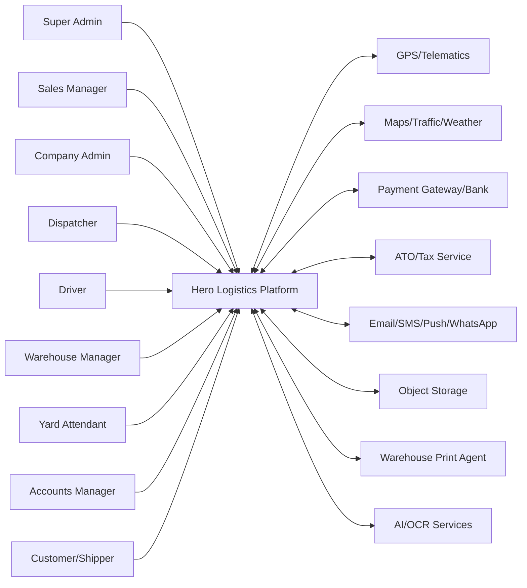
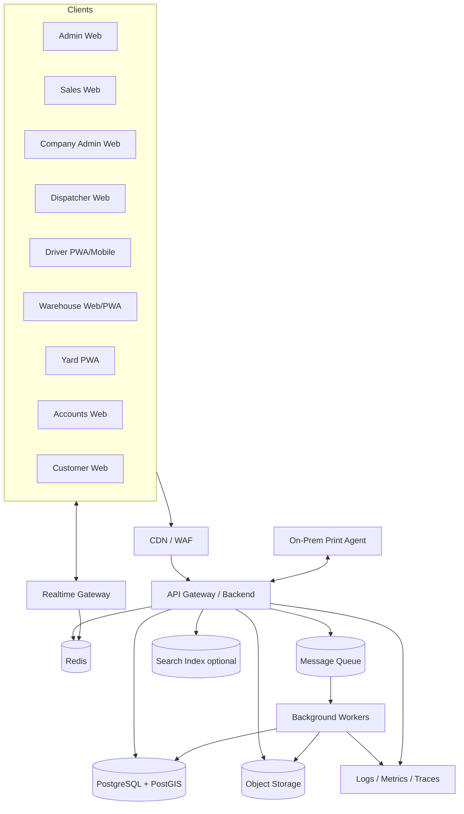
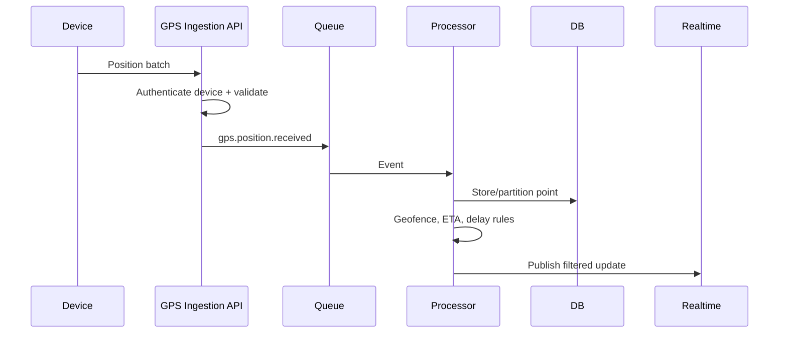
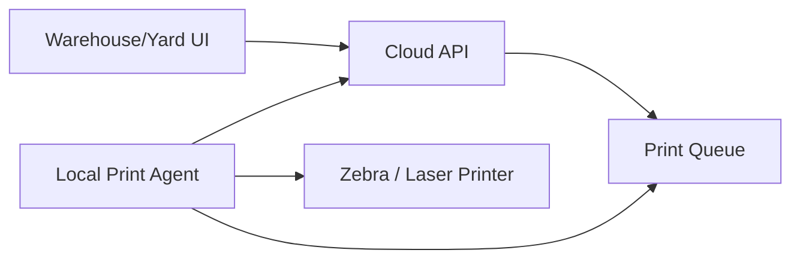

# Hero Logistics — System Architecture Specification

**File:** `architecter.md`  
**Version:** 1.0  
**Prepared Date:** 05 August 2026  
**Architecture Style:** Multi-tenant modular platform with event-driven integration  
**Status:** Recommended implementation architecture

---

## 1. Purpose

This document defines the recommended technical architecture for the Hero Logistics Enterprise Logistics Operating System.

The consolidated requirements cover:

- SaaS tenant governance and white-labeling;
- CRM and trials;
- company administration;
- dispatch and real-time GPS;
- driver mobile and offline workflows;
- warehouse and yard execution;
- accounts, payroll and tax;
- customer self-service;
- reporting, printing, files, notifications and integrations.

The actual application source repository was not provided. This architecture is derived from the complete PRD and is designed to provide a safe implementation baseline.

---

## 2. Architecture Decision Summary

### 2.1 Recommended Starting Architecture

Use a **modular monolith with event-driven boundaries**, not independent microservices on day one.

Reasons:

- many workflows require strong transactions;
- the product has shared master data;
- the team can deliver faster with one backend deployment;
- operational and financial rules can be centralised;
- modules can later be extracted using stable APIs and domain events.

### 2.2 Recommended Stack

| Layer | Recommended |
|---|---|
| Web frontend | React 19 + Vite + TypeScript |
| Mobile/PWA | React PWA initially; React Native where native capability is required |
| UI styling | Tailwind CSS v4 + design tokens |
| Backend | Node.js LTS + TypeScript + NestJS or structured Express |
| API | REST `/api/v1`, WebSocket, signed webhooks |
| ORM | Prisma |
| Database | PostgreSQL 16 + PostGIS |
| Cache | Redis |
| Queue | SQS/RabbitMQ-compatible |
| Files | S3-compatible object storage |
| Search | PostgreSQL FTS initially, OpenSearch later |
| Maps | Leaflet/React Leaflet + routing/geocoding provider |
| Charts | Recharts |
| Authentication | OIDC/JWT with rotating sessions and MFA |
| Observability | OpenTelemetry + central logs, metrics and traces |
| CI/CD | GitHub Actions |
| Container runtime | Docker |
| Production reference | AWS ECS/Fargate + RDS + ElastiCache + S3 + CloudFront |

### 2.3 Database Conflict Decision

The source mentions PostgreSQL/MongoDB and earlier project patterns may use MySQL. Recommended final baseline is PostgreSQL because of:

- PostGIS;
- row-level security;
- relational financial integrity;
- JSONB;
- partitioning;
- mature analytical SQL.

This decision must be formally approved before implementation.

---

## 3. System Context



---

## 4. Container Architecture



---

## 5. Frontend Architecture

### 5.1 Applications

Recommended monorepo applications:

- `apps/platform-admin`
- `apps/sales`
- `apps/company-admin`
- `apps/dispatcher`
- `apps/driver`
- `apps/warehouse`
- `apps/yard`
- `apps/accounts`
- `apps/customer`

Shared packages:

- `packages/ui`
- `packages/design-tokens`
- `packages/api-client`
- `packages/auth`
- `packages/rbac`
- `packages/domain-types`
- `packages/forms`
- `packages/maps`
- `packages/realtime`
- `packages/offline-sync`
- `packages/i18n`
- `packages/testing`

### 5.2 Routing

Role-specific base paths:

- `/admin/*`
- `/sales/*`
- `/company-admin/*`
- `/dispatcher/*`
- `/driver/*`
- `/warehouse/*`
- `/yard/*`
- `/accounts/*`
- `/customer/*`

Tenant domains and branding are resolved before app bootstrapping.

### 5.3 State Management

- server state: TanStack Query;
- local UI state: React state or Zustand;
- forms: React Hook Form + schema validation;
- offline queue: IndexedDB;
- real-time events update query caches;
- do not store access tokens or sensitive records in localStorage.

### 5.4 Responsive Strategy

- Admin, Dispatcher and Accounts: desktop-first with tablet support;
- Warehouse: desktop/tablet/forklift terminal;
- Yard and Driver: mobile/handheld-first;
- Customer: responsive web;
- data tables use responsive column priorities and horizontal scroll;
- complex planning board uses dedicated mobile alternative rather than compressed desktop board.

---

## 6. Backend Modular Architecture

Recommended bounded modules:

1. `platform`
2. `subscriptions`
3. `feature-access`
4. `branding`
5. `support`
6. `identity`
7. `rbac`
8. `crm`
9. `companies`
10. `branches`
11. `customers`
12. `workforce`
13. `drivers`
14. `fleet`
15. `loads`
16. `dispatch`
17. `routing`
18. `telematics`
19. `warehouse`
20. `yard`
21. `inventory`
22. `documents`
23. `printing`
24. `messages`
25. `notifications`
26. `invoicing`
27. `payments`
28. `payroll`
29. `expenses`
30. `tax`
31. `financial-reporting`
32. `reports`
33. `integrations`
34. `audit`
35. `offline-sync`

Each module should contain:

- controller/API;
- application services/use cases;
- domain models and rules;
- repository interfaces;
- infrastructure adapters;
- events;
- tests.

Modules must not directly query another module’s tables except through approved internal service/repository contracts.

---

## 7. Recommended Repository Structure

```text
hero-logistics/
├─ apps/
│  ├─ web-platform-admin/
│  ├─ web-sales/
│  ├─ web-company-admin/
│  ├─ web-dispatcher/
│  ├─ web-driver/
│  ├─ web-warehouse/
│  ├─ web-yard/
│  ├─ web-accounts/
│  ├─ web-customer/
│  ├─ api/
│  ├─ worker/
│  └─ print-agent/
├─ packages/
│  ├─ ui/
│  ├─ api-client/
│  ├─ domain-types/
│  ├─ validation/
│  ├─ auth/
│  ├─ observability/
│  └─ config/
├─ prisma/
│  ├─ schema.prisma
│  ├─ migrations/
│  └─ seed/
├─ infrastructure/
│  ├─ docker/
│  ├─ terraform/
│  └─ monitoring/
├─ docs/
│  ├─ database.md
│  ├─ api_specification.md
│  ├─ architecter.md
│  └─ memory_bran.md
└─ .github/workflows/
```

---

## 8. Multi-Tenancy Architecture

### 8.1 Tenant Context

Tenant context is established by:

- verified domain/subdomain;
- authenticated token claim;
- platform-admin impersonation context.

It is propagated through:

- request context;
- database session;
- queue message;
- realtime event;
- logs and traces.

### 8.2 Isolation Layers

1. CDN/domain routing.
2. Authentication token tenant claim.
3. API tenant guard.
4. repository tenant criteria.
5. PostgreSQL RLS.
6. object-storage path and policy.
7. cache key namespace.
8. queue event tenant envelope.
9. search index tenant filter.
10. audit trail.

### 8.3 Feature and Limit Enforcement

Plan/feature checks occur:

- on navigation;
- at API action;
- before resource creation;
- in background usage reconciliation.

Limits include:

- active users;
- drivers;
- vehicles;
- branches;
- storage;
- AI usage;
- GPS retention;
- report schedules.

---

## 9. Authentication and Authorisation

### Authentication

- OIDC-compatible identity service;
- short access token;
- rotating refresh session;
- MFA;
- password policy;
- device/session management;
- tenant suspension check;
- login throttling.

### Authorisation

Evaluation:

`tenant membership + user status + role + permission + scope + record relationship + feature entitlement`

High-risk actions:

- tenant impersonation;
- compliance override;
- invoice approval;
- refund;
- payroll approval/process;
- tax lodgement;
- export of sensitive data.

These require explicit permissions, reason and sometimes dual approval.

---

## 10. Event-Driven Design

### 10.1 Transactional Outbox

Business transaction writes:

1. domain changes;
2. audit event;
3. outbox event;

in one database transaction.

Worker publishes outbox events to the queue and marks them delivered.

### 10.2 Important Domain Events

- `tenant.provisioned`
- `tenant.suspended`
- `user.invited`
- `load.created`
- `load.activated`
- `load.assignment_changed`
- `load.status_changed`
- `driver.status_changed`
- `gps.position_received`
- `route.delay_detected`
- `inventory.received`
- `inventory.moved`
- `inventory.staged`
- `load.dispatch_ready`
- `load.departed`
- `load.delivered`
- `invoice.created`
- `invoice.sent`
- `payment.received`
- `payment.allocated`
- `payroll.approved`
- `payroll.paid`
- `issue.created`
- `document.generated`
- `notification.requested`

### 10.3 Event Consumers

Examples:

- load delivered → invoice eligibility;
- dispatch-ready → dispatcher notification;
- driver licence expired → assignment eligibility recalculation;
- payment allocated → invoice balance/status update;
- movement completed → map/capacity update;
- POD uploaded → customer notification.

Consumers must be idempotent.

---

## 11. Real-Time Architecture

### 11.1 Realtime Gateway

Use WebSocket/Socket.IO gateway for:

- GPS updates;
- dispatch board changes;
- load status;
- warehouse/yard movement;
- messages;
- notification badges;
- print queue;
- report completion.

### 11.2 Scale

- Redis pub/sub or streams for multi-instance fan-out;
- rooms scoped by tenant/branch/load/conversation;
- server validates room membership;
- clients reconnect and request missed events using last event ID;
- high-volume raw GPS does not broadcast to every user; filter and aggregate first.

---

## 12. GPS and Telematics Architecture

### Ingestion flow



Requirements:

- provider adapter interface;
- batch ingestion;
- deduplication by device/timestamp/provider ID;
- clock-skew handling;
- geofence processing;
- stale/offline detection;
- retention and aggregation;
- permission-controlled history.

---

## 13. Warehouse/Yard Offline Architecture

### 13.1 Offline Data

Store only necessary operational cache in IndexedDB:

- user/depot context;
- assigned tasks;
- allowed locations;
- item identifier cache;
- drafts;
- captured photos pending upload;
- operation queue.

### 13.2 Offline Queue Record

- operation UUID;
- device ID;
- user ID;
- tenant/depot;
- operation type;
- payload;
- device timestamp;
- dependencies;
- retry count;
- state.

### 13.3 Sync Rules

- send ordered batches;
- use idempotency key per operation;
- server validates current source state;
- conflicts return actionable reason;
- never silently overwrite authoritative location;
- user sees pending, synced, failed and conflict states;
- encryption at rest on device;
- remote session revocation blocks future sync.

---

## 14. File and Document Architecture

Flow:

1. API creates upload intent.
2. Client uploads directly to object storage.
3. Object event starts malware scan.
4. Safe file becomes available.
5. Business entity stores file link.
6. Downloads use short-lived signed URL.

Metadata:

- tenant;
- owner;
- purpose;
- checksum;
- MIME;
- size;
- scan state;
- retention;
- legal hold.

Document generation workers render:

- invoices;
- manifests;
- PODs;
- payslips;
- reports;
- labels;
- dispatch dockets.

---

## 15. Printing Architecture

Browsers cannot reliably print directly to warehouse network printers. Use a **local print agent**.



Print agent requirements:

- outbound authenticated connection;
- printer discovery/configuration;
- ZPL/PDF support;
- heartbeat;
- job claim/acknowledgement;
- retry and failure reason;
- no inbound public port;
- tenant/depot binding.

---

## 16. Financial Architecture

### 16.1 Posting Model

Operational modules create source records. Financial service creates controlled postings.

Examples:

- completed load → invoice draft;
- approved expense → cost posting;
- payment allocation → receivable reduction;
- payroll paid → wage/PAYG/super posting;
- vehicle transaction → vehicle cost and P&L account.

### 16.2 Controls

- decimal arithmetic only;
- currency on every transaction;
- closed periods;
- immutable posted records;
- reversal entries;
- maker-checker approval;
- encrypted bank details;
- reconciliation history;
- tax code validation.

### 16.3 Payment Gateway

Use provider adapter:

- create payment/refund;
- query status;
- webhook validation;
- idempotency;
- gateway reference;
- failure and dispute state.

---

## 17. AI and Automation Architecture

AI is advisory unless an approved rule explicitly allows automation.

AI use cases:

- load email/document extraction;
- driver/load suggestions;
- route optimisation;
- delay prediction;
- quick message suggestions;
- OCR receipts/BOL;
- utilisation insights.

Controls:

- human review;
- confidence scores;
- source document retained;
- prompt/model version recorded;
- tenant data isolation;
- PII controls;
- cost quotas;
- no AI bypass of compliance or permissions;
- deterministic rules remain authoritative for hard blocks.

---

## 18. Search Architecture

Phase 1:

- PostgreSQL full-text and trigram indexes;
- exact indexes on load IDs, VIN, rego, barcode, SKU and invoice numbers.

Phase 2:

- OpenSearch for global search and advanced filtering;
- asynchronous index updates from outbox;
- tenant filter mandatory;
- search result links resolve through normal API permission checks.

Search index is not authoritative.

---

## 19. Deployment Architecture

### 19.1 Environments

- local;
- development;
- test;
- UAT;
- production.

### 19.2 Production Reference — AWS

| Component | AWS Service |
|---|---|
| DNS | Route 53 |
| CDN/WAF | CloudFront + AWS WAF |
| Frontend | S3/CloudFront or Amplify |
| API/worker | ECS Fargate |
| Load balancer | Application Load Balancer |
| Database | RDS PostgreSQL Multi-AZ |
| Cache | ElastiCache Redis |
| Queue | SQS |
| Notifications | SNS/SES |
| Files | S3 |
| Secrets | Secrets Manager |
| Logs/metrics | CloudWatch + OpenTelemetry collector |
| Security | GuardDuty, Security Hub where required |
| Backups | RDS PITR + S3 lifecycle/cross-region |

UAT may use Railway or another managed platform, but production architecture must still preserve database, queue, storage, secrets and observability requirements.

---

## 20. Scalability Strategy

### Horizontal scaling

- stateless API instances;
- worker autoscaling by queue depth;
- realtime gateway scaled with Redis adapter;
- read replicas for reporting;
- object storage for files;
- cursor pagination;
- partition telemetry and audit tables.

### Hot paths

- dispatch dashboard;
- planning board;
- GPS map;
- inventory scan;
- movement completion;
- messaging;
- payment allocation.

Use targeted cache with short TTL and event-driven invalidation. Do not cache permission decisions longer than safe.

---

## 21. Reliability and Disaster Recovery

Recommended starting targets:

- availability: 99.9%;
- RPO: 15 minutes or better;
- RTO: 4 hours or better;
- multi-AZ database;
- point-in-time recovery;
- queue retry and dead-letter;
- object versioning;
- restore drills;
- runbooks for GPS, payments, printing and notification outages.

Graceful degradation:

- GPS outage: show stale state, preserve last point;
- message provider outage: queue retry;
- printer offline: retain job;
- map provider outage: operations continue without routing;
- AI outage: manual workflows remain available;
- bank/tax outage: prepare records, delay external submission.

---

## 22. Observability

Every request/job/event includes:

- correlation ID;
- tenant ID;
- user/service actor;
- module;
- entity ID when relevant;
- duration;
- result;
- error code.

Metrics:

- request latency/error;
- queue depth;
- job failures;
- DB connections/query time;
- GPS ingest rate;
- WebSocket connections;
- offline sync conflicts;
- load activation failures;
- inventory movement failures;
- print queue failures;
- invoice/payment/payroll reconciliation failures.

Never log passwords, tokens, full bank accounts, tax numbers or unredacted sensitive payloads.

---

## 23. Security Architecture

### Controls

- WAF and rate limits;
- MFA;
- JWT/session rotation;
- tenant RLS;
- RBAC and scopes;
- least privilege cloud IAM;
- encryption at rest/in transit;
- KMS-managed keys;
- signed file URLs;
- malware scanning;
- audit logs;
- SAST/DAST/dependency scanning;
- secret rotation;
- backup encryption;
- incident response.

### Threats to test

- IDOR and cross-tenant access;
- privilege escalation;
- insecure impersonation;
- webhook forgery;
- offline replay;
- file upload attacks;
- GPS spoofing;
- payment/refund replay;
- financial self-approval;
- report/export leakage;
- printer agent compromise.

---

## 24. CI/CD and Quality Gates

Pipeline:

1. formatting and lint;
2. type checking;
3. unit tests;
4. schema validation;
5. migration test;
6. API contract tests;
7. security/dependency scan;
8. build;
9. integration tests;
10. deploy preview/UAT;
11. smoke tests;
12. approval;
13. production deployment;
14. post-deploy verification.

Deployment strategy:

- rolling or blue/green;
- backward-compatible database migrations;
- feature flags;
- automatic rollback for failed health checks;
- no direct manual production DB changes.

---

## 25. Testing Architecture

- unit tests for domain rules;
- repository integration tests;
- API contract tests;
- permission matrix tests;
- cross-tenant tests;
- end-to-end portal tests;
- event consumer idempotency tests;
- offline sync tests;
- financial calculation and reconciliation tests;
- GPS volume tests;
- print agent tests;
- security tests;
- disaster recovery tests.

Test data must use synthetic tenants and must not copy production PII.

---

## 26. Architecture Decision Records Required

1. ADR-001: PostgreSQL vs MySQL.
2. ADR-002: Modular monolith framework.
3. ADR-003: Authentication provider and cookie/token model.
4. ADR-004: Tenant isolation and PostgreSQL RLS.
5. ADR-005: Queue/event technology.
6. ADR-006: Realtime transport.
7. ADR-007: GPS provider and retention.
8. ADR-008: Object storage and malware scanning.
9. ADR-009: Local print agent.
10. ADR-010: Accounting/payroll integrations.
11. ADR-011: Mobile PWA vs React Native.
12. ADR-012: Search engine timeline.
13. ADR-013: AI provider and data policy.
14. ADR-014: Production cloud and region.
15. ADR-015: Backup RPO/RTO.

---

## 27. Architecture Definition of Done

- ADRs approved;
- module boundaries implemented;
- tenant context propagated end to end;
- database RLS/scope tests pass;
- API contract published;
- event outbox and idempotent workers implemented;
- real-time rooms secured;
- offline queue conflict handling works;
- print agent proof of concept passes;
- financial posting and reconciliation pass;
- observability dashboards and alerts exist;
- backup/restore tested;
- threat model reviewed;
- load/performance tests pass;
- deployment and rollback runbooks approved.

---

**End of `architecter.md`**
