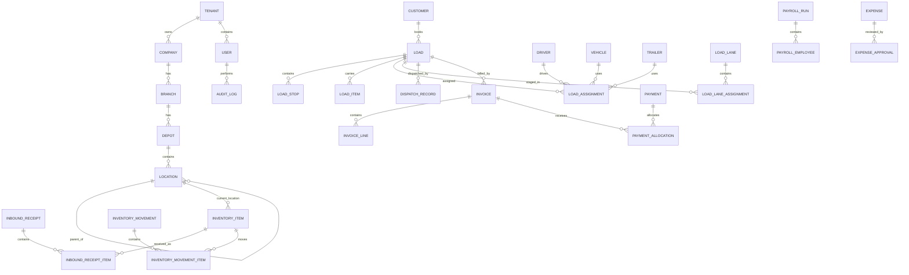

# Hero Logistics — Database Technical Requirements & Schema Specification

**File:** `database.md`  
**Version:** 1.0  
**Prepared Date:** 05 August 2026  
**Source Baseline:** `Hero_Logistics_FINAL_Complete_Master_PRD_v1.0.md`  
**Source SHA-256:** `ff141e9d497690a392bc025fac1b71a809b2f45bedbff1e0c9d0ae1031568113`  
**Status:** Implementation baseline — database engine decision requires final technical approval

---

## 1. Purpose

This document converts the consolidated Hero Logistics product requirements into a database design for the enterprise multi-tenant Logistics Operating System.

It covers:

- SaaS tenant and subscription governance;
- identity, roles and permissions;
- companies, branches, depots and locations;
- sales and onboarding;
- customers and pricing;
- drivers, workforce, vehicles and trailers;
- loads, stops, assignments, tracking and proof;
- warehouse and yard inventory;
- inbound, movements, staging, load lanes and outbound dispatch;
- messaging, notifications and files;
- invoices, payments, payroll, expenses, tax and vehicle costs;
- reports, audit, integrations and offline synchronization.

> The supplied source material does not confirm one final production database engine. It mentions PostgreSQL/MongoDB in the enterprise technology section, while earlier project conventions may use MySQL/Prisma. This specification recommends PostgreSQL as the primary transactional database because the platform requires strong relational integrity, geospatial support, JSON fields, row-level security and high-volume event partitioning. MySQL 8 can be used after an explicit architecture decision, but RLS and PostGIS-specific features must be redesigned.

---

## 2. Recommended Data Platform

### 2.1 Primary Components

| Component | Recommended Technology | Purpose |
|---|---|---|
| Transactional database | PostgreSQL 16+ | Authoritative operational and financial data |
| Geospatial extension | PostGIS | GPS points, geofences, routes and proximity queries |
| ORM | Prisma ORM | Type-safe schema, migrations and application access |
| Cache / ephemeral state | Redis | Sessions, rate limits, locks, live presence and short-lived cache |
| Object storage | S3-compatible storage | Documents, photos, PODs, receipts, labels and exports |
| Search | PostgreSQL FTS initially; OpenSearch later | Global search across loads, items, customers and messages |
| Analytics | Read replica / warehouse later | BI and long-running analytical queries |
| Queue | SQS/RabbitMQ/Kafka-compatible | Asynchronous events and integrations |

### 2.2 Recommended Tenancy Model

Use a **shared database and shared schema** with mandatory `tenant_id` on every tenant-owned table.

Controls:

1. Every tenant-owned query must include `tenant_id`.
2. PostgreSQL Row-Level Security should enforce tenant boundaries.
3. Branch/depot scopes are additional filters, not substitutes for tenant isolation.
4. Platform tables may be global and omit `tenant_id`.
5. Enterprise tenants may optionally receive a dedicated database after a future approved migration.
6. Cross-tenant foreign keys are prohibited.
7. Background jobs must carry explicit tenant context.
8. Audit events must record tenant, company and branch/depot context.

---

## 3. Global Database Conventions

### 3.1 Naming

- Tables: `snake_case`, plural names.
- Primary key: `id`.
- Foreign key: `<entity>_id`.
- Timestamps: `created_at`, `updated_at`.
- Soft delete: `deleted_at`.
- Optimistic lock: `version`.
- Public references: `public_id`, `code`, `reference_no` or domain-specific reference.
- Boolean fields: `is_*`, `has_*`, `requires_*`.
- Enums: lowercase database values exposed as uppercase application constants if desired.

### 3.2 Common Columns

Tenant-owned business tables should normally include:

| Column | Type | Rule |
|---|---|---|
| `id` | UUID | Primary key, UUIDv7 recommended |
| `tenant_id` | UUID | Mandatory tenant scope |
| `company_id` | UUID nullable | Company scope when applicable |
| `branch_id` | UUID nullable | Branch scope when applicable |
| `created_at` | timestamptz | UTC |
| `created_by` | UUID nullable | User or system actor |
| `updated_at` | timestamptz | UTC |
| `updated_by` | UUID nullable | User or system actor |
| `deleted_at` | timestamptz nullable | Soft deletion where permitted |
| `version` | integer | Optimistic concurrency |
| `metadata` | jsonb | Extension data only; not a replacement for core columns |

### 3.3 Data Types

- Money: `numeric(19,4)` plus `currency_code char(3)`.
- Percentage: `numeric(9,4)`.
- Distance: store canonical metres or kilometres with unit metadata.
- Weight: store canonical kilograms.
- Dimensions: store canonical millimetres.
- GPS: `geography(Point,4326)` plus raw latitude/longitude only when needed.
- Time: `timestamptz` in UTC.
- Local schedules: store timezone identifier with schedule.
- Phone numbers: E.164.
- Country: ISO 3166-1 alpha-2.
- Currency: ISO 4217.
- Files: object-storage key, checksum, MIME type and size; never raw binaries in core tables.

### 3.4 Deletion Rules

- Financial posted records, audit logs, movement history, status history and safety evidence must not be physically deleted.
- Draft records may be soft-deleted when authorised.
- Master-data deletion should be prevented when dependent records exist; use inactive status instead.
- Privacy erasure requests must use approved anonymisation while preserving legally required transaction records.

---

## 4. Schema Domains

## 4.1 Platform SaaS and Tenant Governance

### `tenants`

| Column | Type | Notes |
|---|---|---|
| `id` | UUID PK | Canonical tenant ID |
| `tenant_code` | varchar(30) unique | Example `TEN-000123` |
| `legal_name` | varchar(255) | Tenant legal name |
| `display_name` | varchar(255) | UI name |
| `status` | enum | trial, active, suspended, cancelled |
| `plan_id` | UUID FK | Current plan |
| `trial_ends_at` | timestamptz nullable | Trial expiry |
| `default_currency` | char(3) | Default AUD |
| `default_timezone` | varchar(64) | IANA timezone |
| `data_region` | varchar(50) | Hosting region |
| `storage_used_bytes` | bigint | Usage snapshot |
| `settings` | jsonb | Tenant-level settings |

Indexes:

- unique `tenant_code`;
- `(status, trial_ends_at)`;
- `(plan_id, status)`.

### Additional platform tables

| Table | Purpose |
|---|---|
| `tenant_domains` | Custom domain/CNAME and verification state |
| `tenant_branding` | Logos, colours, favicon, email and PDF branding |
| `plans` | Starter, Professional, Enterprise and Custom plans |
| `plan_versions` | Immutable version history |
| `features` | Global feature registry |
| `plan_features` | Default entitlements and limits |
| `tenant_feature_overrides` | Tenant-specific enable/disable or limit |
| `subscriptions` | Billing cycle, current state and renewal |
| `subscription_events` | Upgrade, downgrade, suspension and renewal history |
| `coupons` | Promotions and discounts |
| `subscription_coupons` | Applied discounts |
| `usage_counters` | Users, drivers, fleet, storage, AI and other metered limits |
| `platform_invoices` | SaaS billing invoices |
| `platform_payments` | SaaS subscription payments |
| `platform_health_snapshots` | API, DB, storage and job health metrics |
| `support_tickets` | Tenant support cases |
| `support_ticket_messages` | Ticket conversation |
| `impersonation_sessions` | Audited Super Admin “login as tenant” sessions |

---

## 4.2 Identity, Authentication and RBAC

### Core tables

| Table | Important columns |
|---|---|
| `users` | tenant_id, email, username, password_hash, status, first_name, last_name, timezone, locale |
| `user_profiles` | job_title, phones, address, emergency contact, avatar_file_id |
| `roles` | tenant_id nullable for global roles, role_key, name, scope_type |
| `permissions` | permission_key, module, action, description |
| `role_permissions` | role_id, permission_id, effect |
| `user_roles` | user_id, role_id, valid_from, valid_to |
| `user_scopes` | user_id, scope_type, company_id, branch_id, depot_id, location_id |
| `sessions` | user_id, refresh_token_hash, device, IP, expires_at, revoked_at |
| `mfa_methods` | user_id, type, encrypted_secret, verified_at |
| `password_reset_tokens` | user_id, token_hash, expires_at, used_at |
| `email_verification_tokens` | user_id, token_hash, expires_at |
| `user_invitations` | email, role_id, scope, token_hash, expiry |
| `login_attempts` | email/user_id, IP, result, reason |
| `security_events` | event_type, severity, actor and target |

Constraints:

- unique lowercased email within tenant unless platform identity is global;
- no plaintext tokens or passwords;
- role and scope changes must generate audit events;
- suspended tenant or user cannot create active sessions.

---

## 4.3 Sales, CRM, Trials and Onboarding

| Table | Purpose |
|---|---|
| `crm_leads` | Prospect company and contact details |
| `crm_deals` | Pipeline opportunity and expected value |
| `crm_deal_stage_history` | Immutable stage changes |
| `crm_activities` | Calls, emails, tasks and notes |
| `crm_demo_bookings` | Demo calendar records |
| `crm_proposals` | Proposal versions and files |
| `crm_trials` | Trial workspace, dates and conversion state |
| `crm_onboarding_checklists` | Handover and tenant activation tasks |
| `crm_sources` | Lead source registry |

Suggested deal stages:

`new_lead`, `qualified`, `demo_scheduled`, `proposal_sent`, `trial_active`, `negotiation`, `closed_won`, `closed_lost`.

---

## 4.4 Company, Branch, Depot and Location Hierarchy

### Core tables

| Table | Purpose |
|---|---|
| `companies` | Tenant legal entities, ABN/ACN/NZBN and operational settings |
| `company_addresses` | Registered, billing and operational addresses |
| `branches` | Regional branch records |
| `depots` | Physical logistics depots |
| `warehouses` | Warehouse facilities |
| `yards` | Yard facilities |
| `locations` | Generic hierarchical operational location |
| `location_types` | Depot, warehouse, zone, row, bay, position, lane, dock, etc. |
| `location_capacities` | Unit, weight, volume, vehicle and container capacity |
| `location_restrictions` | Dangerous goods, cold chain, value storage and access |
| `location_status_history` | Status and capacity changes |
| `geofences` | Polygon/circle location boundaries |

### `locations` key design

- self-referencing `parent_location_id`;
- `path` or materialized path for hierarchy queries;
- `location_code` unique per tenant/depot;
- `location_type_id`;
- optional PostGIS geometry;
- status: active, inactive, restricted, maintenance, full, closed;
- capacity values and current utilisation should be transactionally maintained or derived.

---

## 4.5 Customers, Contacts and Commercial Rules

| Table | Purpose |
|---|---|
| `customers` | Customer master record |
| `customer_contacts` | Operational, accounts and escalation contacts |
| `customer_addresses` | Billing, pickup, delivery and depot addresses |
| `customer_billing_profiles` | Terms, tax settings, account status |
| `customer_transport_modules` | Enabled services |
| `customer_pricing_agreements` | Contract rate cards and effective dates |
| `customer_credit_settings` | Credit limit and hold state |
| `customer_notes` | Scoped internal notes |
| `customer_documents` | Agreements and compliance documents |

Constraints:

- ABN/ACN uniqueness configurable;
- inactive/suspended customers cannot create new loads unless override permission exists;
- billing terms and credit settings must be restricted to authorised roles.

---

## 4.6 Drivers, Workforce, Vehicles and Trailers

### Driver and workforce tables

| Table | Purpose |
|---|---|
| `drivers` | Driver operational and employment profile |
| `driver_licences` | Licence class, number, state and expiry |
| `driver_certifications` | DG, heavy vehicle, first aid and custom certifications |
| `driver_documents` | Medical, police, training and other evidence |
| `driver_preferences` | Preferred routes, assets and maximum distance |
| `driver_availability` | Available/unavailable windows |
| `driver_shifts` | Planned shifts |
| `work_sessions` | Start/finish work records |
| `leave_requests` | Leave periods and approval |
| `driver_status_history` | Duty and operational status changes |
| `driver_performance_snapshots` | Delivery, incident and compliance metrics |
| `driver_activity_events` | Safety, assignment, document and payroll timeline |

### Fleet tables

| Table | Purpose |
|---|---|
| `vehicles` | Trucks, prime movers, utilities and equipment |
| `trailers` | Trailer master and capacity |
| `asset_types` | Vehicle/trailer/equipment classification |
| `asset_assignments` | Driver, vehicle, trailer and load assignment history |
| `vehicle_documents` | Registration, insurance and roadworthy |
| `trailer_documents` | Trailer compliance evidence |
| `maintenance_work_orders` | Planned and corrective maintenance |
| `maintenance_events` | Service actions and inspections |
| `odometer_readings` | Odometer history and source |
| `fuel_transactions` | Fuel quantity, cost and odometer |
| `telematics_devices` | Provider/device mapping |
| `asset_status_history` | Available, active, maintenance, out-of-service, etc. |

Hard rules:

- expired mandatory documents block assignment;
- maintenance/out-of-service assets block assignment;
- overlapping active assignment must be prevented;
- truck/trailer compatibility and capacity must be validated.

---

## 4.7 Loads, Stops, Items, Dispatch and Proof

### `loads`

Important columns:

- `id`, `tenant_id`, `company_id`, `branch_id`;
- `load_reference`, `customer_id`, `load_type`;
- `primary_status`, `operational_status`;
- `priority`, `booking_channel`;
- `scheduled_start_at`, `scheduled_end_at`;
- `required_delivery_at`;
- `origin_location_id`, `destination_location_id`;
- `currency_code`;
- `quoted_amount`, `actual_amount`;
- `current_assignment_id`;
- `progress_basis`, `progress_value`;
- `hold_reason`, `cancel_reason`;
- `completed_at`, `cancelled_at`;
- `version`.

Indexes:

- unique `(tenant_id, load_reference)`;
- `(tenant_id, branch_id, primary_status, scheduled_start_at)`;
- `(tenant_id, customer_id, created_at desc)`;
- `(tenant_id, operational_status, required_delivery_at)`;
- full-text/search index for reference and route.

### Supporting load tables

| Table | Purpose |
|---|---|
| `load_stops` | Ordered pickup, delivery, depot and checkpoint stops |
| `load_items` | Vehicles, pallets, cartons, DG, containers and other cargo |
| `load_item_vehicle_details` | VIN, rego, make, model and dimensions |
| `load_assignments` | Driver/truck/trailer/team assignment history |
| `load_status_history` | Immutable lifecycle transitions |
| `load_notes` | Internal and driver-visible notes |
| `load_documents` | BOL, manifest, POD and instructions |
| `load_photos` | Pickup, loading and delivery evidence |
| `load_signatures` | Electronic signature/POD |
| `route_plans` | Calculated route and optimisation version |
| `route_events` | Departure, arrival, deviation and ETA changes |
| `delivery_issues` | Delay, failed delivery, damage and missing document |
| `load_quotes` | Rate quote and acceptance |
| `rate_confirmations` | Customer/contractor confirmation documents |

Constraints:

- each activated load requires valid stops;
- every load item must map pickup and drop-off stops;
- completion requires configured proof;
- status transition and assignment history are immutable;
- updates use optimistic locking.

---

## 4.8 GPS, Telemetry, Geofences and HOS

| Table | Purpose |
|---|---|
| `gps_positions` | High-volume point telemetry |
| `gps_trip_segments` | Aggregated movement segments |
| `geofence_events` | Entry and exit events |
| `telemetry_events` | Speed, heading, ignition and provider events |
| `eta_predictions` | Predicted stop and delivery ETA |
| `route_deviations` | Deviation detection |
| `driver_hos_logs` | Hours-of-service records |
| `fatigue_events` | Break and fatigue compliance |
| `location_share_requests` | Dispatcher-sent destinations and confirmation |

Partition `gps_positions` by month or day depending on volume. Recommended indexes:

- `(tenant_id, device_id, recorded_at desc)`;
- GiST index on `position`;
- `(tenant_id, load_id, recorded_at desc)`;
- retention and aggregation jobs.

---

## 4.9 Warehouse, Yard and Inventory

### Inventory master

| Table | Purpose |
|---|---|
| `inventory_items` | Canonical item and current location |
| `inventory_item_identifiers` | VIN, rego, barcode, SKU, serial and container numbers |
| `inventory_item_dimensions` | Weight and dimensions |
| `inventory_item_status_history` | In storage, staged, ready, hold, dispatched |
| `inventory_item_condition_history` | Condition and damage history |
| `inventory_reservations` | Reservation for loads/tasks |
| `inventory_locks` | Short-lived operation lock |

### Receiving and movement

| Table | Purpose |
|---|---|
| `inbound_receipts` | Receipt header |
| `inbound_receipt_items` | Received items |
| `inventory_movements` | Movement header |
| `inventory_movement_items` | Per-item source/destination and result |
| `transfer_jobs` | Cross-depot transfer |
| `transfer_job_items` | Transfer item reconciliation |
| `staging_areas` | Specialised holding locations |
| `staging_assignments` | Item-to-staging history |
| `load_lanes` | Lane master |
| `load_lane_assignments` | Load and item lane assignments |
| `dispatch_records` | Outbound verification and departure |
| `scan_events` | Barcode/QR decode and action |
| `yard_gate_events` | Gate check-in/check-out |
| `seal_checks` | Seal verification |
| `yard_move_tasks` | Hostler/equipment movement task |

### Issues, checklists and printing

| Table | Purpose |
|---|---|
| `safety_checklist_templates` | Versioned checklist definition |
| `safety_checklist_submissions` | Checklist header |
| `safety_checklist_answers` | Per-question answer |
| `issues` | Damage, missing item, safety and access issue |
| `issue_evidence` | Photos/documents |
| `barcode_labels` | Generated label record |
| `printers` | Network/local printer registry |
| `print_jobs` | Print spool queue |
| `print_job_items` | Pages/labels |
| `document_templates` | Manifest, docket, label and invoice templates |
| `generated_documents` | Rendered document metadata |

Atomicity requirement:

A completed movement must update item current location, source/destination capacity, reservation/lane state and audit log in one transaction or reliable event workflow.

---

## 4.10 Messaging, Notifications and Communications

| Table | Purpose |
|---|---|
| `conversations` | Direct, group, team or load-linked conversation |
| `conversation_participants` | Membership and read state |
| `messages` | Message body and delivery state |
| `message_attachments` | File/location/document references |
| `message_receipts` | Delivered/read states |
| `announcements` | Company/branch announcements |
| `notification_templates` | Channel templates |
| `notifications` | Per-recipient notification |
| `notification_deliveries` | Push, email, SMS and WhatsApp attempts |
| `scheduled_messages` | Future delivery |
| `communication_preferences` | User channel preferences |

Messages linked to a load, issue, invoice or ticket should store polymorphic `context_type` and `context_id` or explicit join tables.

---

## 4.11 Accounts and Financial Operations

### Receivables

| Table | Purpose |
|---|---|
| `invoices` | Customer invoice header |
| `invoice_lines` | Charges and tax |
| `invoice_attachments` | Invoice evidence |
| `invoice_status_history` | Immutable workflow |
| `credit_notes` | Controlled correction |
| `credit_note_lines` | Credit details |
| `payments` | Incoming customer payment |
| `payment_allocations` | Payment-to-invoice allocation |
| `payment_refunds` | Refund workflow |
| `bank_transactions` | Imported bank feed |
| `reconciliations` | Reconciliation batch |
| `reconciliation_items` | Matching results |
| `customer_credits` | Available credit balance |

### Payroll and payables

| Table | Purpose |
|---|---|
| `payroll_runs` | Pay-period header |
| `payroll_employees` | Employee calculation result |
| `payroll_earnings` | Base, overtime, allowance and reimbursement |
| `payroll_deductions` | PAYG, super, sacrifice and other deductions |
| `payslips` | Generated payslip metadata |
| `contractors` | Contractor master and tax setup |
| `contractor_claims` | Claim header |
| `contractor_claim_lines` | Claim charges |
| `contractor_payments` | Disbursement |
| `expenses` | Employee/contractor expense |
| `expense_receipts` | Receipt files |
| `expense_approvals` | Approval chain |
| `expense_payments` | Reimbursement |

### Tax and reporting

| Table | Purpose |
|---|---|
| `financial_periods` | Open/closed accounting periods |
| `tax_codes` | GST treatment |
| `tax_periods` | BAS/PAYG period |
| `gst_transactions` | GST collected/credit source |
| `payg_transactions` | PAYG withholding |
| `bas_lodgements` | Lodgement versions and response |
| `vehicle_cost_transactions` | Cost assigned to asset |
| `chart_of_accounts` | Reporting account registry |
| `journal_entries` | Lightweight posting header |
| `journal_lines` | Debit/credit lines |
| `financial_snapshots` | P&L/cash dashboard snapshots |

> A complete general-ledger product is listed as out of scope in the source PRD. However, reliable P&L, GST and reconciliation require at least a controlled posting layer. The `chart_of_accounts`, `journal_entries` and `journal_lines` tables are therefore recommended as an internal financial reporting foundation, not necessarily as a user-facing full GL module.

Financial rules:

- posted records cannot be overwritten;
- closed periods block edits;
- refund and reversal preserve original records;
- all money fields include currency;
- bank/tax details require field-level encryption;
- self-approval and approval limits are configurable.

---

## 4.12 Reports, Imports, Exports, Audit and Integration

| Table | Purpose |
|---|---|
| `report_definitions` | Standard/custom report metadata |
| `report_runs` | Parameters, actor, status and result |
| `report_schedules` | Recurrence and recipients |
| `export_jobs` | Asynchronous export |
| `import_jobs` | Upload and parse state |
| `import_job_rows` | Row-level validation |
| `files` | Shared object-storage metadata |
| `file_links` | Entity-to-file association |
| `audit_logs` | Immutable business/security audit |
| `outbox_events` | Transactional outbox |
| `integration_connections` | Provider configuration references |
| `integration_sync_runs` | Sync state and metrics |
| `webhook_subscriptions` | Tenant outbound webhook config |
| `webhook_deliveries` | Attempts and responses |
| `offline_sync_batches` | Device synchronization batch |
| `offline_sync_operations` | Per-operation result |
| `idempotency_keys` | Request replay protection |

### `audit_logs`

Recommended fields:

- tenant/company/branch/depot;
- actor user and role;
- impersonating Super Admin if applicable;
- module and action;
- entity type and ID;
- before and after JSON;
- reason;
- source/destination location where relevant;
- IP, user agent and device;
- GPS where permitted;
- correlation ID;
- occurred_at;
- hash chain or tamper-evident signature for high-assurance deployments.

Partition by month and retain according to legal policy.

---

## 5. Canonical Status Registry

### Load primary status

`draft`, `planned`, `active`, `completed`, `cancelled`

### Load operational status

`not_ready`, `ready`, `pending_dispatch`, `assigned`, `accepted`, `en_route_to_pickup`, `at_pickup`, `loaded`, `in_transit`, `at_stop`, `at_delivery`, `delivered`, `on_hold`, `delayed`, `failed_delivery`, `returned`, `cancelled`

### Inventory status

`expected`, `receiving`, `in_storage`, `reserved`, `to_move`, `staged`, `ready`, `on_hold`, `damaged`, `quarantined`, `in_transit`, `dispatched`, `returned`

### Movement status

`draft`, `pending`, `in_progress`, `completed`, `partially_completed`, `failed`, `cancelled`

### Lane status

`empty`, `available`, `reserved`, `staging`, `in_progress`, `ready_to_dispatch`, `hold`, `full`, `restricted`, `maintenance`, `closed`

### Driver status

`available`, `on_duty`, `en_route`, `at_pickup`, `at_delivery`, `break`, `off_duty`, `on_leave`, `unavailable`, `delayed`, `offline`

### Asset status

`available`, `active`, `assigned`, `in_transit`, `maintenance`, `out_of_service`, `sold`, `inactive`

### Compliance status

`compliant`, `expiring_soon`, `overdue`, `not_uploaded`, `under_review`, `rejected`, `not_applicable`

### Financial statuses

Use separate canonical enums for invoices, payments, payroll, contractor claims, expenses and tax periods exactly as specified in the Accounts PRD.

---

## 6. Relationship Diagram



---

## 7. Indexing and Performance Strategy

1. Every tenant table: leading composite index on `tenant_id`.
2. Common list pages: composite indexes matching tenant + scope + status + date.
3. Unique public references: `(tenant_id, reference_no)`.
4. Search identifiers: normalized VIN, rego, barcode, SKU and customer reference indexes.
5. Geospatial: GiST indexes.
6. JSONB: GIN only for fields used in queries.
7. GPS, audit, message and notification tables: time partitioning.
8. Financial tables: indexes on period, status, customer, due date and posted date.
9. Avoid unbounded `OFFSET` for very large data; support cursor pagination.
10. Use read replicas or analytics stores for heavy reports.
11. Archive old telemetry while keeping aggregate history.

---

## 8. Transaction and Concurrency Rules

Use a database transaction for:

- load activation and resource reservation;
- assignment swaps;
- receipt completion;
- movement completion;
- lane capacity updates;
- dispatch confirmation;
- payment allocation;
- refund posting;
- payroll approval/posting;
- tax lodgement state changes.

Optimistic concurrency:

- client sends current `version`;
- update includes `WHERE id = ? AND version = ?`;
- server increments version;
- stale update returns HTTP 409.

Use advisory/distributed locks only for short critical sections such as payroll processing, report generation and bulk dispatch.

---

## 9. Row-Level Security Example

```sql
ALTER TABLE loads ENABLE ROW LEVEL SECURITY;

CREATE POLICY loads_tenant_policy ON loads
USING (tenant_id = current_setting('app.tenant_id')::uuid)
WITH CHECK (tenant_id = current_setting('app.tenant_id')::uuid);
```

Application transactions must set tenant context after authentication. Super Admin access must use a separate audited pathway and must not disable tenant checks globally.

---

## 10. Migration and Seed Strategy

### Migration rules

- migrations are immutable after production release;
- destructive changes require staged expand/migrate/contract deployment;
- backfills run as resumable jobs;
- every migration is tested against representative production volume;
- enum changes must be backward compatible during deployment;
- financial and audit tables require special review.

### Seed data

Seed only:

- global permissions;
- core roles;
- location types;
- status registry;
- tax codes;
- plan feature registry;
- report definitions;
- checklist templates;
- development demo data in non-production environments.

Never seed real credentials, production customer data or secrets.

---

## 11. Backup, Retention and Recovery

Recommended starting objectives:

| Data | Retention |
|---|---|
| Core operational records | Per contract/legal policy, commonly 7+ years |
| Financial and tax records | Legal requirement, commonly 7 years in Australia |
| Audit logs | Minimum 7 years for high-risk events |
| GPS raw positions | Configurable, e.g. 90–365 days |
| GPS aggregates | Longer-term operational reporting |
| Messages | Configurable company policy |
| Documents/photos | Contract and legal policy |
| Failed integration payloads | Limited, redacted retention |

Backups:

- point-in-time recovery;
- daily snapshots;
- encrypted cross-region copy where required;
- quarterly restore tests;
- documented RPO/RTO.

---

## 12. MySQL Compatibility Notes

When MySQL 8 is selected:

- replace PostgreSQL RLS with mandatory repository-level tenant filters and security tests;
- use spatial indexes with MySQL GIS limitations;
- replace JSONB-specific operators;
- use generated columns for frequently queried JSON values;
- implement partitioning carefully for telemetry;
- maintain the same logical tables and constraints;
- use application or trigger enforcement where partial indexes are unavailable.

The engine choice must be recorded in an Architecture Decision Record before schema implementation.

---

## 13. Open Decisions

1. PostgreSQL 16 or MySQL 8?
2. Shared schema with RLS or database-per-enterprise tenant?
3. Prisma ORM or another data layer?
4. Is a complete general ledger required?
5. Exact GPS raw-data retention?
6. Exact audit retention?
7. Multi-currency at launch?
8. Which tax jurisdictions beyond Australia/New Zealand?
9. Which identifiers are globally unique versus tenant unique?
10. Should inventory quantity support split/merge lots?
11. Should messages be legally retained with operational records?
12. Dedicated analytics warehouse at launch or later?
13. Dedicated OpenSearch at launch or later?
14. Required RPO and RTO?
15. Which fields need customer-managed encryption keys?

---

## 14. Database Definition of Done

- all tables include correct tenant/scope controls;
- foreign keys and uniqueness rules are implemented;
- indexes support documented screens and filters;
- status transitions are enforced by service logic;
- high-risk updates are transactional;
- optimistic locking is enabled;
- audit and outbox events are generated;
- financial totals reconcile;
- RLS/tenant isolation tests pass;
- migrations and rollback strategy are documented;
- backup and restore are verified;
- sensitive fields are encrypted or masked;
- performance tests pass with expected volume.

---

**End of `database.md`**
